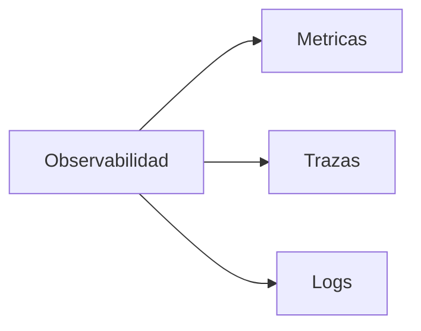

# Introducción
Primero que nada debemos tener bien en mente que **la observabilidad es la capacidad de comprender el estado de un sistema** mediante el analisis de sus datos, esto nos permite detectar e identificar qué, como, cuando y donde ocurre cualquier problema y/o errores que se presente en nuestro sistema.
En la actualidad identificar cada evento generado en nuestros sistemas, se vuelve un reto cada vez más complicado debido a la cantidad de elementos que interactúan en un sistema, el poder resolver una tarea puede consistir desde un solo llamado a un microservicio, hasta el poder consumir cientos de microservicios y llamados a bases de datos, con lo cual, el saber que ocurre en cada elemento y como se comporta es una tarea que puede tomar mucho tiempo y el resolver un problema puede ser bastante desgastante.
Para poder decir que tenemos una observabilidad aplicada debemos contar con los tres pilares de observabilidad: Metricas , Trazas y Logs

# Metricas

Las metricas son el pilar mas simple de toda la observabilidad, estas nos permiten identificar el rendimiento de nuestros sistemas mediante el monitoreo de recursos como CPU, consumo de memoria y latencia.

# Trazas

El monitoreo de trazas es un APM (Aplication performance monitoring) que se compone por una traza principal y que puede o no contener uno o multiples spans, estos elementos son los que nos permiten monitorear el rendimiento de las solicitudes en un sistema, desde que una solicitud es registrada en el frontend, es posible ver el recorrido que se realizó por todos los componentes del sistema, logrando comprender la ruta y el rendimiento de la solicitud, cuellos de botella y diagnosticar problemas de latencia.

# Logs
Los registros de log son eventos almacenados generalmente en archivos, que nos proporcionan información sobre el resultado de una tarea, mediante un mensaje es posible comprender cual fue la causa de un error o cual fue el resultado de la operación, entender donde y cuando se realizo dicha tarea y quien fue el encargado de iniciarla.
Existen dos tipos de logs:
* Estructurados: Cada registro de log esta almacenado de manera que una maquina puede interpretar y analizar la información. (Json, XML, CSV, etc)
* No estructurados: Cada registro de log esta almacenado solo por una cadena de texto, solo una persona puede interpretar el contenido sin la necesidad de realizar un procesamiento de la información.

# Correlación de la información
Es importante saber que el solo contar con la recolección de datos de los pilares de observabilidad no es suficiente para poder decir que tenemos una observabilidad, también es importante que esta información se encuentre centralizada en una sola plataforma y que la data de cada pilar este relacionada mediante algún campo:
* Logs y trazas: Deben de estar correlacionados por un TraceId de tal manera que yo visualizar solo logs que estan relacionados a la solicitud que estoy analizando.
* Metricas y logs : Deben estar relacionados por el nombre del host y fecha, de tal manera que pueda ver cual fue el rendimiento de mi equipo y los registros de logs que se generaron  en ese momento.
* Trazas y metricas: Deben estar relacionados por el nombre del host y fecha de tal manera que pueda visualizar que solicitudes obtuve y como se comporto mi infraestructura en ese momento.
Si tenemos la capacidad de poder realizar estas actividades sin estar abriendo multiples plataformas, terminales o archivos, podemos decir que hemos alcanzado una observabilidad.
